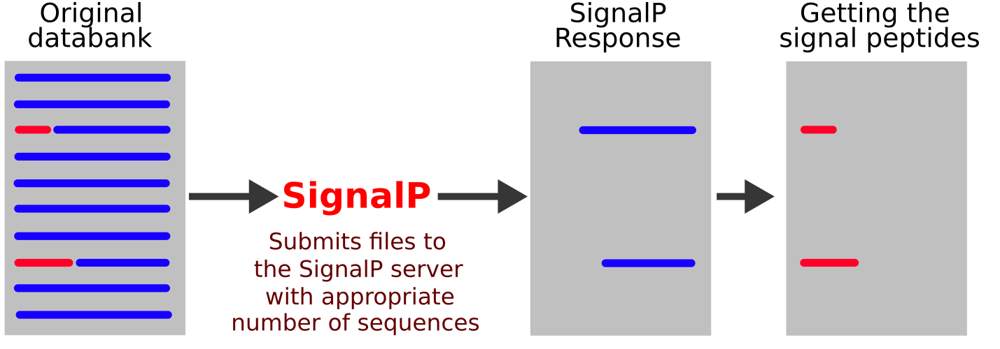

# Python Client for the SignalP Server


signalPclient is small Python module that automates the submission of a sequence databank to SignalP 4.1 Server, a web service that detects and predicts the cleavage points of signal peptides for Gram-positive prokaryotes, Gram-negative prokaryotes, and eukaryotes. SignalP Server is hosted by the Center for Biological Sequence Analysis at the Technical University of Denmark (DTU):

http://www.cbs.dtu.dk/services/SignalP/

We started developing signalPclient during the [Python Hackathon](https://github.com/thmosqueiro/UCLA-Collaboratory_Hackathon/blob/master/Materials_Resources/Problem-4/Readme.md), hosted by the [QCB Collaboratory](https://qcb.ucla.edu/collaboratory/) at UCLA. SignalP Server was originally proposed on a [Nature Methods paper](https://www.nature.com/articles/nmeth.1701) by TN Petersen, S Brunak, G von Heijne and H Nielsen.





## Quick intro: Installation and usage

If you have pip, you can install signalPclient using:
```
pip install git+https://github.com/QCB-Collaboratory/signalPclient
```
Otherwise, you can download signalPclient and use run its setup script. To download it, simply click [here](https://github.com/thmosqueiro/signalPclient/archive/master.zip). After unzipping the file, navigate to the unzipped signalPclient directory and run:
```
python setup.py install
```

If you have a fasta file ```databank.fasta``` with sequences that you want to submit to SignalP Server, run:
```
import signalPclient
SPclient = signalPclient( input='databank.fasta', output='signalP.fasta' )
SPclient.submit()
```


## Questions, comments and bugs

If you have questions, comments or found a bug in our script, feel free to open an issue on the [Issues Page](https://github.com/QCB-Collaboratory/SignalPclient/issues). Also, feel free to submit Pull Requests in case you have modified the script to enhance or improve it.


## Dependencies

signalPclient has minimal requirements, and works with both Python 2 or 3. Other than the standard Python libraries, signalPclient only requires:

* pyfasta
* MechanicalSoup


## People involved

* Thiago Mosqueiro
* Xiaofei Lin
* Anela Tosevska
* Cheng Chen
* João VD Molino


## License to use

Feel free to use/share/modify/redistribute this Python script, which is shared under the [MIT license](./LICENSE). This is a short and permissive license with conditions only requiring preservation of copyright and license notices. Licensed works, modifications, and larger works may be distributed under different terms and without source code.
